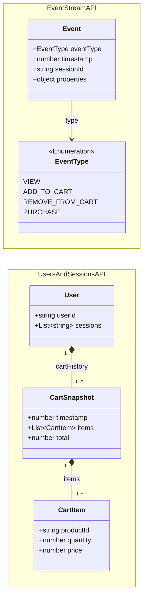
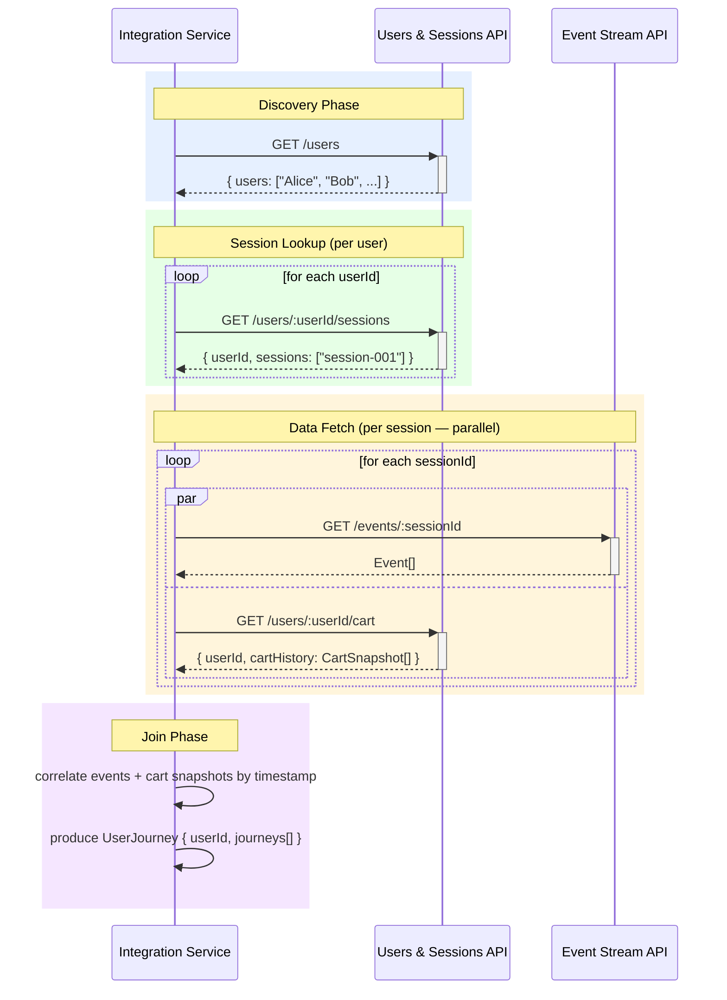

# Architecture

## Overview

This project integrates two existing read-only mock APIs to produce user journeys as JSON. The two APIs are owned externally and must not be modified. They are session-scoped and user-scoped respectively, and the integration layer is responsible for joining them.

**Do not modify anything under `external/`.** Both APIs are off-limits.

---

## Service Topology

```
┌──────────────────────────────────────────────────────┐
│  External APIs (read-only, do not modify)            │
│                                                      │
│  ┌─────────────────────┐  ┌─────────────────────┐   │
│  │   Event Stream API  │  │ Users & Sessions API │   │
│  │   localhost:3000    │  │   localhost:3001     │   │
│  └─────────────────────┘  └─────────────────────┘   │
└──────────────────────────────────────────────────────┘
                    ▲                 ▲
                    │                 │
           ┌────────┴─────────────────┴────────┐
           │       Integration Service          │
           │  (built by the kata participant)   │
           └───────────────────────────────────┘
```

---

## Domain Types

### Event Stream API

```
Event
  eventType   : EventType      -- the kind of interaction
  timestamp   : number         -- unix timestamp
  sessionId   : string         -- which session this event belongs to
  properties  : object         -- event-specific payload (varies by type)

EventType (enum)
  VIEW
  ADD_TO_CART
  REMOVE_FROM_CART
  PURCHASE
```

`properties` shape by event type:

| eventType | properties keys |
|---|---|
| VIEW | productId, category |
| ADD_TO_CART | productId, quantity |
| REMOVE_FROM_CART | productId, quantity |
| PURCHASE | productId, quantity, price |

### Users & Sessions API

```
User
  userId      : string         -- user's name (e.g. "Alice", "Bob")
  sessions    : string[]       -- session IDs owned by this user

CartSnapshot
  timestamp   : number         -- unix timestamp of this cart state
  items       : CartItem[]     -- all items in the cart at this moment
  total       : number         -- total value of the cart

CartItem
  productId   : string
  quantity    : number
  price       : number
```

---

## Public API Contracts

### Event Stream API — `localhost:3000`

```
GET /health
  → { status: "ok" }

GET /events/:sessionId
  → Event[]
  404 if no events exist for that sessionId
```

**Constraints:**
- Returns all events for the session in one response — no pagination.
- Reads `large-events.json` from disk on every request (no in-memory cache).
- Does not include `userId` — caller must resolve that separately.
- The large dataset includes intentional edge cases: absurd quantities (250–5000), missing `productId`, negative prices, zero/negative quantities, far-future timestamps.

### Users & Sessions API — `localhost:3001`

```
GET /health
  → { status: "ok" }

GET /users
  → { users: string[] }                      -- all 25 user IDs

GET /users/session/:sessionId
  → { userId, sessionId }
  404 if session not found

GET /users/:userId/sessions
  → { userId, sessions: string[] }
  404 if user not found

GET /users/:userId/cart
  → { userId, cartHistory: CartSnapshot[] }
  404 if user not found

GET /users/:userId/cart?timestamp=N
  → { userId, timestamp, items, total }
  404 if no snapshot exists at that exact timestamp
  400 if timestamp is not a valid integer
```

**Constraints:**
- Cart timestamp lookup is **exact-match only** — there is no range query or nearest-neighbor. If no snapshot exists at the given timestamp, the response is 404.
- Walter (`session-023`) has an empty `cartHistory` array — not a 404, just empty.
- Each user currently maps to exactly one session, but the schema supports many.
- Data is stored as in-memory JavaScript maps in `db.js` — no database, no persistence.

---

## Key Flows

### Integration Join Pattern

The join key between the two APIs is `sessionId`. The recommended traversal:

```
1. GET /users                                → list of all userIds
2. for each userId:
     GET /users/:userId/sessions             → their sessionIds
3. for each sessionId (can be parallel):
     GET /events/:sessionId                  → raw event stream
     GET /users/:userId/cart                 → full cart history
4. Correlate cart snapshots to events by timestamp
5. Produce UserJourney output
```

**Timestamp correlation note:** Cart snapshots are keyed to specific timestamps. The `?timestamp=N` endpoint only matches exact values, so the integration layer must work with the full cart history array and correlate by proximity or known ADD_TO_CART event timestamps.

### Session-to-User Reverse Lookup (alternative entry point)

If you already have a `sessionId` and need the user:

```
GET /users/session/:sessionId  →  userId
```

This is useful if processing event-first rather than user-first.

---

## Data Set

25 users (Alice through Yara), each with one session (`session-001` through `session-025`).

Edge cases in the large dataset (see `external/event-stream/data/LARGE_EVENTS_INDEX.md`):
- Absurd quantities (250–5000 items in cart snapshots)
- Events with missing `productId`
- Negative prices and zero/negative quantities
- Far-future timestamps
- `session-023` (Walter): only `REMOVE_FROM_CART` events, empty cart history
- `session-025` (Yara): only `VIEW` and `PURCHASE` events, single cart snapshot

---

## Source Layout

```
external/
├── event-stream/
│   ├── server.js              ← Express app, mounts /events
│   ├── routes/
│   │   └── events.js          ← GET /events/:sessionId handler
│   └── data/
│       ├── large-events.json  ← primary dataset (read on every request)
│       ├── events.json        ← small dataset (not used by server)
│       └── LARGE_EVENTS_INDEX.md
│
└── users-and-sessions/
    ├── server.js              ← Express app, global error handler
    ├── routes.js              ← all 4 route handlers
    └── db.js                  ← in-memory maps: sessionToUser, userSessions, cartHistory
```

---

## Architecture Diagram


## Class Diagram



## Sequence Diagram

### Integration Join Flow


